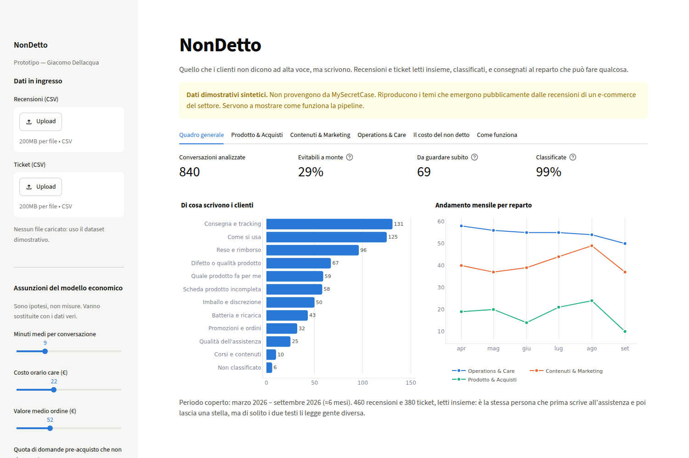
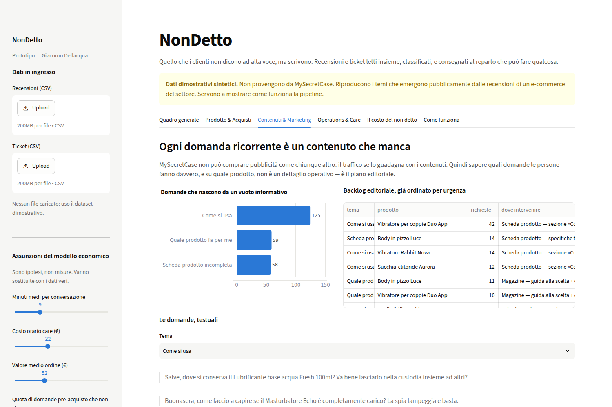
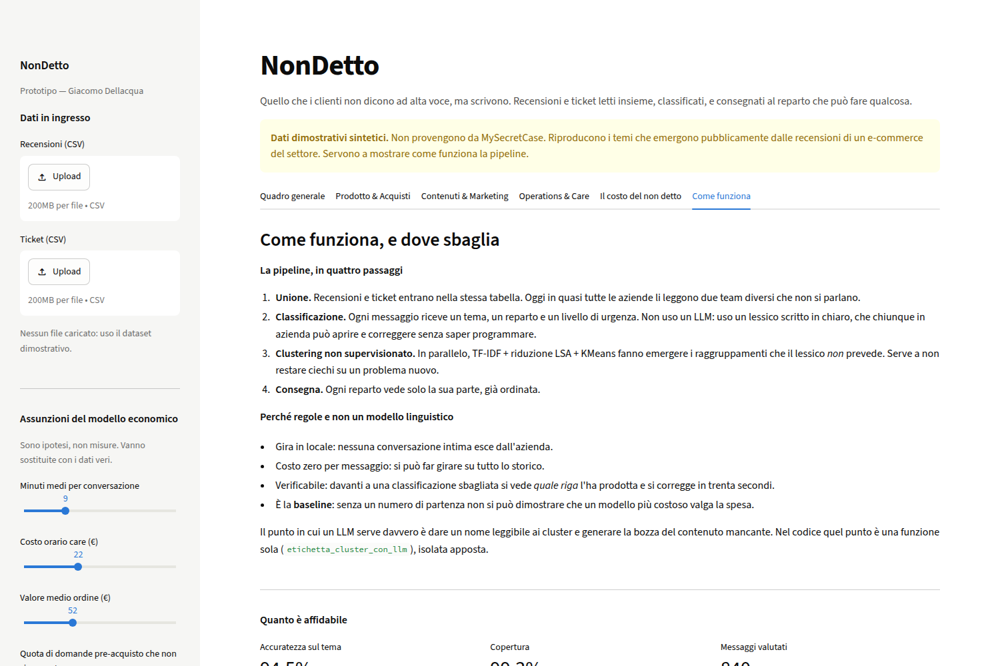

# NonDetto

**Quello che i clienti non dicono ad alta voce, ma scrivono.**

Prototipo che legge insieme recensioni e ticket di assistenza di un e-commerce,
li classifica per tema, urgenza e reparto, e consegna a ciascun reparto solo la
parte su cui può agire.

Progetto realizzato come candidatura per **MySecretCase** — Giacomo Dellacqua,
settembre 2026.



---

## Il problema

In quasi tutte le aziende recensioni e ticket li leggono due team diversi che non
si parlano. Il ticket muore quando il caso si chiude; la recensione finisce in un
report di reputazione. Nessuno dei due arriva a chi scrive le schede prodotto o a
chi sceglie i fornitori — che sono esattamente le due persone che potrebbero far
sparire il problema alla radice.

È la stessa persona che prima scrive all'assistenza e poi lascia una stella.

## Cosa fa

| Reparto | Cosa riceve |
|---|---|
| **Prodotto & Acquisti** | i guasti ricorrenti, concentrati per SKU. Un difetto sparso su tutto il catalogo è rumore; concentrato su due codici è un fornitore. |
| **Contenuti & Marketing** | le domande che si ripetono, già ordinate. Ogni domanda ricorrente è un pezzo di contenuto che manca. |
| **Operations & Care** | volumi per tema e canale, e in cima chi ha già scritto senza ricevere risposta. |

Più una misura sintetica, **il costo del non detto**: la quota di conversazioni
nate da un'informazione che il cliente cercava e non ha trovato. Sul dataset
dimostrativo è il 29% — conversazioni che si riducono scrivendo, non assumendo.



## Avvio

```bash
pip install -r requirements.txt
python src/genera_dataset.py    # crea il dataset dimostrativo
streamlit run app.py
```

L'app si apre su `http://localhost:8501`.

## Usarlo su dati veri

Servono due CSV, caricabili dalla barra laterale dell'app:

- **`recensioni.csv`** — `id, data, fonte, sku, prodotto, categoria, rating, testo`
- **`ticket.csv`** — `id, data, canale, sku, prodotto, categoria, testo`

La colonna `tema_reale` presente nei file dimostrativi serve solo a misurare
l'accuratezza della classificazione: su dati veri non c'è, e il resto funziona
lo stesso.

## Come funziona

```
recensioni.csv ─┐
                ├─→ unione ─→ classificazione ─→ clustering ─→ tre viste
ticket.csv ─────┘              (lessico)        (TF-IDF+LSA
                                                  +KMeans)
```

1. **Unione.** Recensioni e ticket entrano nella stessa tabella.
2. **Classificazione.** Ogni messaggio riceve un tema, un reparto e un livello di
   urgenza, da un lessico scritto in chiaro in `src/pipeline.py`.
3. **Clustering non supervisionato.** In parallelo, TF-IDF → riduzione LSA →
   KMeans fanno emergere i raggruppamenti che il lessico *non* prevede. Serve a
   non restare ciechi su un problema nuovo.
4. **Consegna.** Ogni reparto vede solo la sua parte, già ordinata.

### Perché regole e non un LLM

La scelta più facile sarebbe stata dare tutto in pasto a un modello linguistico.
Ho scelto un classificatore a regole, ed è una decisione che difendo:

- **Gira in locale.** Nessuna conversazione intima esce dall'azienda. Su questo
  mercato non è un dettaglio.
- **Costa zero per messaggio.** Si può far girare su tutto lo storico, non su un
  campione.
- **È verificabile.** Davanti a una classificazione sbagliata si vede *quale riga*
  del lessico l'ha prodotta, e la corregge anche chi non programma.
- **È la baseline.** Senza un numero di partenza non si può dimostrare che un
  modello più costoso valga la spesa.

Il punto in cui un LLM serve davvero c'è, ed è preciso: dare un nome leggibile ai
cluster e scrivere la bozza del contenuto mancante. Nel codice è isolato in una
funzione sola, `etichetta_cluster_con_llm`.

### Una nota tecnica che vale la pena leggere

La riduzione LSA prima del KMeans non è decorativa. Sulla matrice TF-IDF grezza —
migliaia di colonne quasi tutte a zero — le distanze si appiattiscono e KMeans
butta due terzi dei messaggi in un unico cluster gigante. Riducendo a poche decine
di dimensioni i temi si separano: il cluster più grande passa da 335 a 151
messaggi su 840.

Stesso discorso per la rimozione dei nomi di prodotto prima di clusterizzare:
senza, i gruppi si formano sul *prodotto* invece che sul *problema*, e il
risultato è inutile — il prodotto lo sappiamo già dall'ordine, quello che non
sappiamo è cosa non funziona.

## I dati

**I dati inclusi sono sintetici**, generati da `src/genera_dataset.py`. Non
provengono da MySecretCase. Riproducono i temi che emergono pubblicamente dalle
recensioni di un e-commerce del settore: consegne e tracking, resi e rimborsi,
batteria e ricarica, istruzioni mancanti, scelta del prodotto, discrezione del
pacco.

Il generatore rispetta vincoli di coerenza — un lubrificante non ha la batteria,
un capo di abbigliamento non ha l'app — perché senza quei vincoli il dataset
produce assurdità che si notano al primo sguardo e tolgono credibilità a tutto il
resto.

## Limiti dichiarati



- L'accuratezza misurata (**94,5%**, copertura 99,3%) è calcolata su dati generati
  da modelli di frase: misura la **coerenza interna della pipeline**, non le
  prestazioni su testi reali. Su dati veri va rifatta su un campione annotato a
  mano — circa 300 messaggi. Mi aspetto che il numero scenda.
- Ironia, sarcasmo e dialetto non sono gestiti.
- Un messaggio che contiene due problemi diversi riceve una sola etichetta.
- Il modello economico si regge su assunzioni, esposte come cursori nell'app
  proprio perché vanno sostituite con i dati dell'azienda.
- Il clustering si tara a occhio sul numero di gruppi: è il pezzo più fragile.

## Come l'ho costruito

Questo prototipo è stato scritto **con assistenza AI**, e lo dico in apertura
perché per un ruolo che riguarda l'AI mi sembra parte della candidatura e non una
nota a piè di pagina.

Non vengo da Informatica e non scrivo scikit-learn a memoria. Quello che so fare è
capire dove l'AI risolve un problema vero, portarla a qualcosa che gira in pochi
giorni, e rispondere di ogni riga di quello che ne esce — perché un classificatore
a regole invece di un LLM, perché la riduzione LSA prima del clustering, perché
quel numero di accuratezza vale meno di quanto sembra.

## Struttura

```
app.py                  dashboard Streamlit
src/pipeline.py         classificazione, clustering, aggregazioni
src/genera_dataset.py   generatore del dataset dimostrativo
data/                   CSV in ingresso
docs/                   screenshot
```

## Licenza

MIT — vedi [LICENSE](LICENSE).
